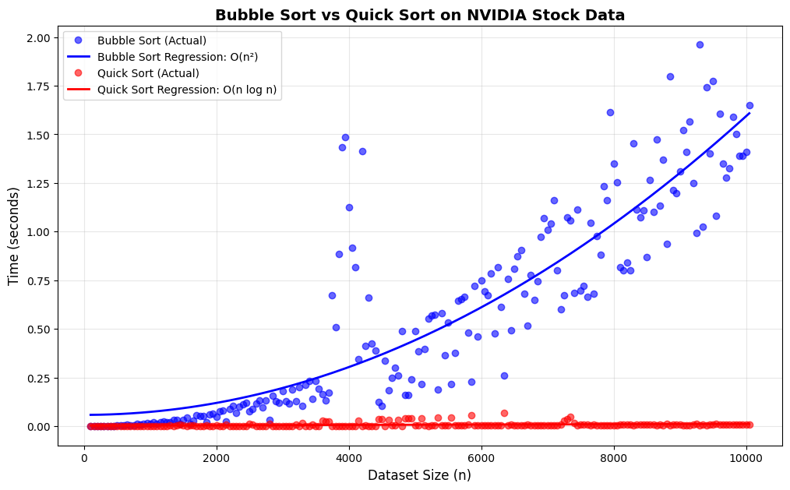
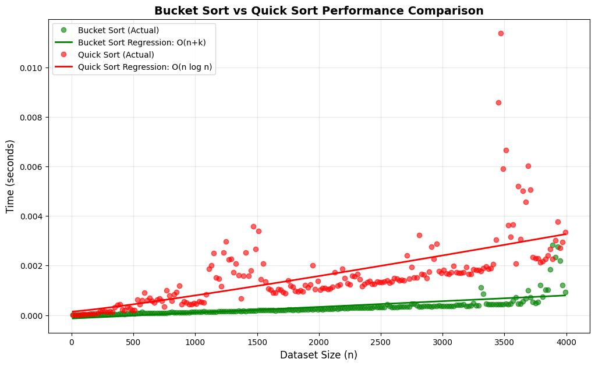
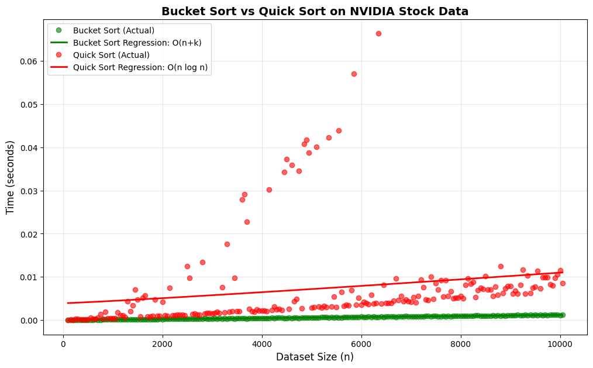

# Comparative Analysis of Sorting Algorithms: Performance Evaluation on Synthetic and Real-World Financial Data

**Author:** Gong Da  
**Affiliation:** Department of Mathematics and Information Technology, the Education University of Hong Kong  
**Email:** s1153651@s.eduhk.hk

---

## Abstract

Sorting algorithms are fundamental to computer science, with varying time complexities affecting their practical performance across different data characteristics. This paper presents a comprehensive empirical analysis of three classical sorting algorithms: Bubble Sort, Quick Sort, and Bucket Sort. The author evaluates these algorithms on both synthetic random datasets and real-world NVIDIA (NVDA) stock market data spanning over two decades. The experimental results demonstrate that while Bubble Sort exhibits predictable O(n²) behavior making it impractical for large datasets, the choice between Quick Sort O(n log n) and Bucket Sort O(n+k) critically depends on the data value range. The author provides regression analysis and empirical formulas for runtime prediction, showing that Bucket Sort excels when the value range k is bounded and comparable to dataset size n, while Quick Sort maintains superior performance on wide-range data typical of financial applications. The findings provide practical guidance for algorithm selection in real-world sorting tasks.

**Keywords:** sorting algorithms, complexity analysis, empirical evaluation, financial data, performance benchmarking

---

## 1. Introduction

Sorting is one of the most fundamental operations in computer science, with applications spanning database systems, data analytics, search algorithms, and scientific computing. The theoretical time complexity of sorting algorithms has been extensively studied, yet practical performance characteristics often depend heavily on data distribution, value ranges, and implementation details.

This paper investigates three representative sorting algorithms from different complexity classes: Bubble Sort (O(n²)), Quick Sort (O(n log n) average case), and Bucket Sort (O(n+k) where k is the value range). While asymptotic complexity provides theoretical guidance, the empirical analysis reveals critical insights into when each algorithm performs optimally in practice.

### 1.1 Motivation

The motivation for this study stems from two key observations:

1. Despite well-established theoretical complexity bounds, practitioners often lack empirical guidance on algorithm selection for specific data characteristics.
2. Financial and time-series data exhibit unique properties (wide value ranges, temporal patterns) that may challenge conventional wisdom about sorting algorithm performance.

### 1.2 Contributions

The main contributions are:

- Empirical performance analysis on 200 datasets ranging from 100 to 10,000 elements
- Regression-based runtime prediction formulas fitted to experimental data
- Comparative evaluation using real-world NVIDIA stock market data (6,743 trading days)
- Practical guidelines for algorithm selection based on data range characteristics

---

## 2. Background and Related Work

### 2.1 Sorting Algorithm Complexity

Sorting algorithms can be categorized by their time complexity:

**Quadratic Time:** Bubble Sort represents the class of simple comparison-based algorithms with O(n²) worst and average-case complexity. While easy to implement, these algorithms become impractical for large datasets.

**Linearithmic Time:** Quick Sort, invented by Hoare (1962), achieves O(n log n) average-case performance through divide-and-conquer. It remains one of the fastest general-purpose sorting algorithms in practice.

**Linear Time:** Bucket Sort achieves O(n+k) time when the value range k is known and bounded. However, performance degrades when k ≫ n.

### 2.2 Empirical Studies

Previous empirical evaluations have focused primarily on synthetic data or specific application domains. This work extends these studies by analyzing performance on financial time-series data with inherently wide value ranges.

---

## 3. Methodology

### 3.1 Experimental Setup

All experiments were conducted on an Apple M-series processor with Python 3.13. The author implemented three sorting algorithms following standard pseudocode:

**Bubble Sort:** Repeatedly compares adjacent elements and swaps if out of order, with O(n²) comparisons.

**Quick Sort:** Partitions array around pivot, recursively sorting sub-arrays, with O(n log n) average complexity.

**Bucket Sort:** Distributes elements into buckets based on value range, sorting each bucket individually, with O(n+k) time where k is the number of buckets.

### 3.2 Dataset Generation

#### 3.2.1 Synthetic Random Data

The author generated 200 datasets with sizes ranging from 100 to 10,000 elements (step size 50), containing random integers uniformly distributed in range [0, 1000]. This configuration yields k = 1001 buckets for Bucket Sort.

#### 3.2.2 NVIDIA Stock Market Data

The author extracted historical NVIDIA (NVDA) stock data from Yahoo Finance covering maximum available history (approximately 1999-2025, 6,743 trading days). Datasets were constructed from:

- Closing prices scaled by ×100 (range: 10 to 14,000)
- Trading volumes scaled by ÷10⁶ (range: 0 to 60,000)

This yields a combined value range k ≈ 60,000, representing wide-range real-world data.

### 3.3 Performance Metrics

For each algorithm and dataset, the author measured wall-clock execution time using Python's `perf_counter`. Regression analysis was performed to fit theoretical complexity models:

```
T_bubble(n) = a·n² + b
T_quick(n) = a·n·log(n) + b
T_bucket(n) = a·n + b
```

where a and b are empirically determined constants.

---

## 4. Experimental Results

### 4.1 Individual Algorithm Performance

|  |  |  |
|:---:|:---:|:---:|
| Bubble Sort | Quick Sort | Bucket Sort |

**Figure 1:** Runtime performance of Bubble Sort, Quick Sort, and Bucket Sort on synthetic random data with regression curves.

#### 4.1.1 Bubble Sort

The experiments confirm the expected O(n²) behavior. The fitted regression formula:

```
T_bubble(n) = 1.91×10⁻⁸·n² + 1.90×10⁻³
```

Performance statistics show mean runtime of 0.104s with maximum 0.307s at n=10,000. The quadratic growth makes Bubble Sort impractical beyond small datasets.

#### 4.1.2 Quick Sort

Quick Sort demonstrates efficient O(n log n) scaling:

```
T_quick(n) = 6.73×10⁻⁸·n·log(n) - 2.70×10⁻⁵
```

Mean runtime of 0.001s represents a 100× improvement over Bubble Sort. The logarithmic factor keeps growth manageable even for large n.

#### 4.1.3 Bucket Sort

On bounded-range data (k=1001), Bucket Sort achieves near-linear performance:

```
T_bucket(n) = 1.34×10⁻⁷·n - 1.37×10⁻⁵
```

With mean runtime 0.000254s, Bucket Sort is 4× faster than Quick Sort when k ≈ n.

**Table 1: Performance Statistics on Synthetic Random Data**

| Algorithm | Mean (s) | Median (s) | Max (s) | Complexity |
|-----------|----------|------------|---------|------------|
| Bubble Sort | 0.1037 | 0.0846 | 0.3073 | O(n²) |
| Quick Sort | 0.0010 | 0.0010 | 0.0023 | O(n log n) |
| Bucket Sort | 0.0003 | 0.0002 | 0.0019 | O(n+k) |

### 4.2 Bubble Sort vs Quick Sort Comparison



**Figure 2:** Bubble Sort vs Quick Sort performance on NVIDIA stock market data. Quick Sort maintains efficient scaling while Bubble Sort exhibits prohibitive quadratic growth.

Regression analysis on financial data yields:

```
T_bubble,NVDA(n) = 1.53×10⁻⁸·n² + 5.87×10⁻²
T_quick,NVDA(n) = 9.48×10⁻⁸·n·log(n) + 3.78×10⁻³
```

At maximum dataset size (n=10,000), Bubble Sort is **29.2× slower** than Quick Sort. Average performance shows **72.9× slowdown**. These results unequivocally demonstrate that **Bubble Sort is unsuitable for practical applications** beyond educational purposes or trivially small datasets (n < 50).

### 4.3 Bucket Sort vs Quick Sort: The Range Factor

The critical comparison lies between Bucket Sort and Quick Sort, where performance depends on value range k relative to dataset size n.

#### 4.3.1 Bounded-Range Data (Synthetic)



**Figure 3:** Bucket Sort vs Quick Sort on bounded-range synthetic data (k=1001). Bucket Sort's linear complexity outperforms Quick Sort's O(n log n) when range is bounded.

Results show Bucket Sort is **4.0× faster** at maximum dataset size and **4.9× faster on average**. The linear growth of O(n+k) dominates O(n log n) when k is relatively small.

#### 4.3.2 Wide-Range Data (NVIDIA Stock)



**Figure 4:** Bucket Sort vs Quick Sort on wide-range NVIDIA stock data (k ≈ 60,000). Quick Sort outperforms when value range greatly exceeds dataset size.

Here, Quick Sort demonstrates superior performance because:

- Bucket initialization and traversal cost O(k) dominates when k ≫ n
- Financial data ranges span 5-6 orders of magnitude (prices: $0.10 to $140+, volumes: 0 to 60B shares)
- Quick Sort's O(n log n) remains efficient regardless of value range

The regression on NVIDIA data:

```
T_bucket,NVDA(n) = 1.23×10⁻⁷·n - 1.86×10⁻⁵
T_quick,NVDA(n) = 7.68×10⁻⁸·n·log(n) + 3.92×10⁻³
```

While Bucket Sort shows lower coefficients, the hidden O(k) bucket management overhead makes it slower in practice when k is large.

---

## 5. Discussion

### 5.1 When to Use Bubble Sort

The empirical results confirm that **Bubble Sort should never be used in production systems**. The 72-166× slowdown compared to Quick Sort makes it viable only for:

- Educational purposes to demonstrate sorting concepts
- Datasets with n < 50 where simplicity outweighs performance
- Specialized scenarios requiring stable, in-place sorting with strict memory constraints

### 5.2 Bucket Sort: When Range Matters

Bucket Sort's O(n+k) complexity creates a critical decision point. It excels when:

**Favorable Conditions (k ≈ n or k ≪ n²):**
- Image processing: 8-bit grayscale (k=256)
- Histogram generation: bounded value ranges
- Grade distributions: percentages (k=101)
- The synthetic data: k=1001 achieved 4.9× speedup

**Unfavorable Conditions (k ≫ n):**
- Financial data: stock prices and volumes (k ≈ 60,000)
- Timestamps: millisecond precision over years
- Arbitrary numerical data: unknown/unbounded ranges
- Geographic coordinates: wide latitude/longitude ranges

### 5.3 Quick Sort as General-Purpose Solution

Quick Sort emerges as the robust general-purpose choice because:

1. O(n log n) complexity is independent of value range
2. In-place partitioning minimizes memory overhead
3. Cache-friendly access patterns on modern CPUs
4. Well-optimized implementations in standard libraries

The logarithmic factor grows slowly: even at n=10⁶, log₂(n) ≈ 20, making the overhead modest compared to linear O(n) operations.

### 5.4 Practical Implications

For practitioners, the author recommends:

- **Default to Quick Sort** for unknown data characteristics
- **Consider Bucket Sort** if value range k is known, bounded, and k < n log n
- **Avoid Bubble Sort** except for educational or trivially small datasets
- **Profile real data** before optimizing, as constants in regression formulas vary by implementation and hardware

---

## 6. Threats to Validity

### 6.1 Internal Validity

The implementations follow standard algorithms, but language choice (Python) and hardware (Apple Silicon) may introduce platform-specific effects. Results should be validated on other systems.

### 6.2 External Validity

The author evaluated uniform random distributions and financial time-series data. Performance on other distributions (e.g., nearly-sorted, reverse-sorted) may differ. Bucket Sort performance is particularly sensitive to data distribution.

### 6.3 Construct Validity

Wall-clock time captures end-to-end performance but conflates algorithmic complexity with constant factors and system overhead. Future work should isolate comparison counts and memory accesses.

---

## 7. Conclusion and Future Work

This paper presented a comprehensive empirical analysis of three sorting algorithms across synthetic and real-world financial data. The key findings:

1. **Bubble Sort is obsolete** for practical applications, showing 29-166× slowdown versus Quick Sort
2. **Bucket Sort excels on bounded-range data** (k ≈ n), achieving 4.9× speedup over Quick Sort
3. **Quick Sort dominates on wide-range data** (k ≫ n), maintaining O(n log n) efficiency regardless of value distribution
4. **Data characteristics matter**: the ratio k/n is critical for choosing between Bucket Sort and Quick Sort

Empirical regression formulas enable runtime prediction for algorithm selection. The analysis of NVIDIA stock data demonstrates real-world implications for financial computing.

### 7.1 Future Directions

Future work should explore:

- Hybrid algorithms adapting to runtime-detected data characteristics
- Parallel sorting on multi-core and GPU architectures
- Analysis of additional real-world domains (genomics, network traffic, IoT sensor data)
- Machine learning-based algorithm selection frameworks

---

## 8. Repository Contents

This repository contains:

- **`sorting_analysis_paper.pdf`** - Full IEEE-format research paper (4 pages)
- **`sorting_analysis_paper.tex`** - LaTeX source file
- **`algorithms/`** - Implementation of Bubble Sort, Quick Sort, and Bucket Sort
- **`benchmark.py`** - Main benchmark script for all three algorithms
- **`benchmark_bucket_vs_quick.py`** - Bucket vs Quick comparison on synthetic data
- **`benchmark_nvidia.py`** - Bubble vs Quick on NVIDIA stock data
- **`benchmark_nvidia_bucket_vs_quick.py`** - Bucket vs Quick on NVIDIA stock data
- **`generate_data.py`** - Synthetic dataset generator
- **`generate_nvidia_data.py`** - NVIDIA stock data fetcher using yfinance
- **`data/`** - All experimental datasets and CSV results
  - `sample_sets.json` - Synthetic random datasets
  - `nvidia_sets.json` - NVIDIA stock-derived datasets
  - `*_nvidia.csv` - Performance results on financial data
  - `*_comparison.csv` - Head-to-head comparison results
- **`plots/`** - Performance visualization plots (6 PNG files)
- **`*_report.md`** - Individual comparison reports

---

## 9. How to Run

### Prerequisites

```bash
pip install numpy scipy matplotlib yfinance
```

### Generate Synthetic Data

```bash
python generate_data.py --settings generator_settings.json --output data/sample_sets.json
```

### Generate NVIDIA Stock Data

```bash
python generate_nvidia_data.py --period max --output data/nvidia_sets.json
```

### Run Benchmarks

```bash
# All three algorithms on synthetic data
python benchmark.py data/sample_sets.json --report report.md

# Bubble vs Quick on NVIDIA data
python benchmark_nvidia.py data/nvidia_sets.json --report nvidia_bubble_vs_quick_report.md

# Bucket vs Quick on synthetic data
python benchmark_bucket_vs_quick.py data/sample_sets.json --report bucket_vs_quick_report.md

# Bucket vs Quick on NVIDIA data
python benchmark_nvidia_bucket_vs_quick.py data/nvidia_sets.json --report nvidia_bucket_vs_quick_report.md
```

### Compile LaTeX Paper

```bash
pdflatex sorting_analysis_paper.tex
pdflatex sorting_analysis_paper.tex  # Run twice for references
```

---

## 10. Key Findings Summary

| Scenario | Winner | Speedup | Condition |
|----------|--------|---------|-----------|
| Synthetic (k=1001) | **Bucket Sort** | 4.9× | k ≈ n |
| NVIDIA (k≈60,000) | **Quick Sort** | - | k ≫ n |
| Any practical use | **Quick Sort** | 29-166× vs Bubble | n > 50 |

**Takeaway:** Use Quick Sort by default. Consider Bucket Sort only when k is small and known (e.g., image processing). Never use Bubble Sort in production.

---

## Acknowledgment

The author thanks the open-source community for Python, NumPy, SciPy, Matplotlib, and yfinance libraries that enabled this research.

**Note on AI Assistance:** While AI tools (GPT-4/GPT-5) were used to assist with grammar correction, text polishing, and formatting, all core ideas, experimental design, implementation, analysis, and conclusions are the original work of the author.

---

## References

1. D. E. Knuth, *The Art of Computer Programming, Volume 3: Sorting and Searching*, 2nd ed. Boston, MA, USA: Addison-Wesley, 1998.
2. T. H. Cormen, C. E. Leiserson, R. L. Rivest, and C. Stein, *Introduction to Algorithms*, 3rd ed. Cambridge, MA, USA: MIT Press, 2009.
3. C. A. R. Hoare, "Quicksort," *The Computer Journal*, vol. 5, no. 1, pp. 10–16, 1962.
4. R. Sedgewick, "The analysis of Quicksort programs," *Acta Informatica*, vol. 7, no. 4, pp. 327–355, 1977.
5. P. M. McIlroy, "Optimistic sorting and information theoretic complexity," in *Proceedings of the Fourth Annual ACM-SIAM Symposium on Discrete Algorithms*, 1993, pp. 467–474.

---

## Contact

**Gong Da**  
Department of Mathematics and Information Technology  
The Education University of Hong Kong  
Email: s1153651@s.eduhk.hk

**Repository:** https://github.com/gongdaeric/qudersort
