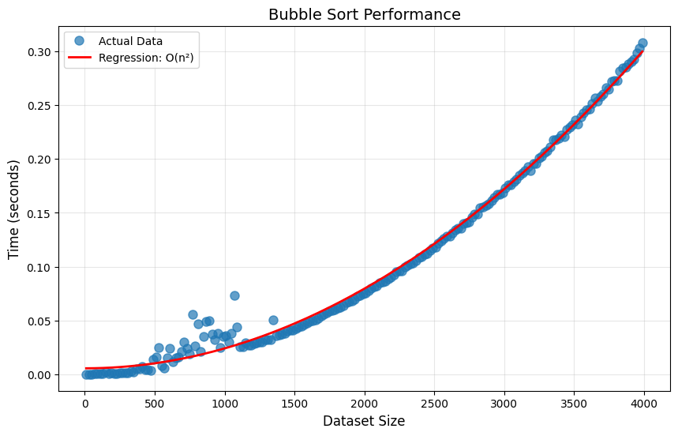
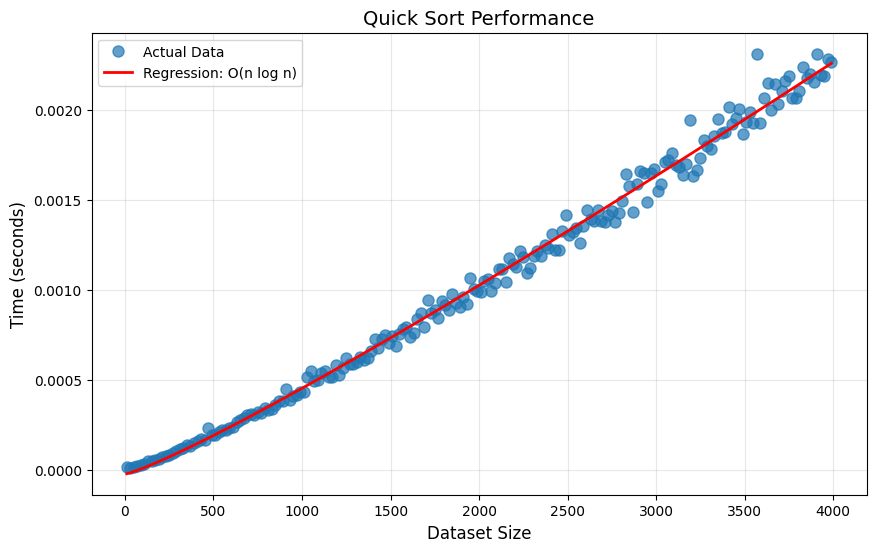
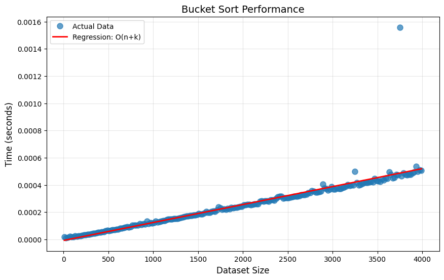

# Sorting Algorithm Benchmark Report


## Bubble Sort

**Theoretical Complexity:** O(n²)

**Regression Formula:**
```
T(n) = 1.91e-08·n² + 1.90e-03
```

**Statistics:**
- Mean: 0.103715s
- Median: 0.084570s
- Max: 0.307284s

**Data:** [Bubble Sort CSV](data/bubble_sort.csv)



## Quick Sort

**Theoretical Complexity:** O(n log n)

**Regression Formula:**
```
T(n) = 6.73e-08·n·log(n) + -2.70e-05
```

**Statistics:**
- Mean: 0.001022s
- Median: 0.000994s
- Max: 0.002261s

**Data:** [Quick Sort CSV](data/quick_sort.csv)



## Bucket Sort

**Theoretical Complexity:** O(n+k)

**Regression Formula:**
```
T(n) = 1.34e-07·n + -1.37e-05
```

**Statistics:**
- Mean: 0.000254s
- Median: 0.000241s
- Max: 0.001888s

**Data:** [Bucket Sort CSV](data/bucket_sort.csv)

